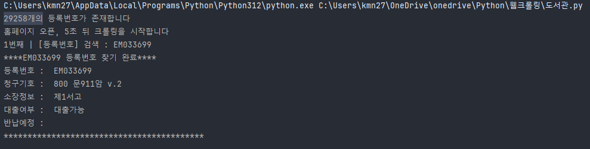
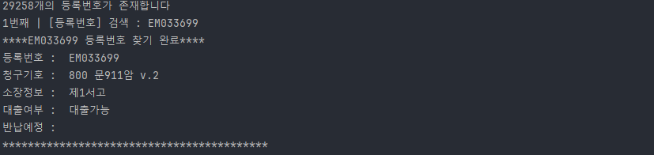
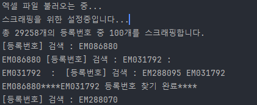
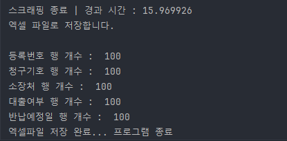
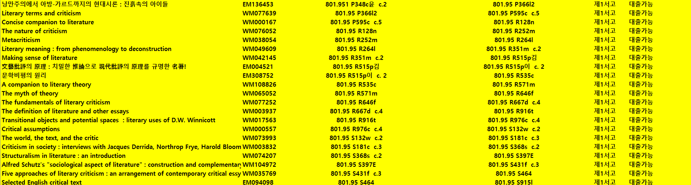

# 도서관 도서 정배열 오류를 체크하는 프로젝트

---

# ◇ 프로젝트 목적

### 문제 발견 및 문제 인식
>도서관에서 책을 찾고 정리하다보면 정배열이 어긋난 부분이 많이 있다.
>책이 `1 → 2 → 3 → 4 → 5` 순서대로 서가에 있어야 하는데 사람들이 다루다보니 오류가 발생하여
>`3 → 1 → 87 → 4 → 5` 이런 식으로 순서가 어긋난다.

>사용자가 많지 않은 방학기간에는 도서관에서 모든 책을 검사하게 된다. 서가에 순서대로 도서에 있는 등록번호를 작성하고, 엑셀로 저장한다. 여기서 저장된 것은 실제 서가에 꽂혀있는 순서이다. 즉 해당 작업 후 파일을 이용한다면 잘못 정배열된 부분을 확인하고, 올바른 위치에 옮길 수 있다고 생각.

### 해결 방법 모색
1. 파이썬을 이용하여 등록번호가 저장된 엑셀 파일을 읽어온다
2. 크롤링, 스크래핑 라이브러리를 사용하여 학교 도서관 홈페이지를 통해 도서 정보를 받아온다.
	1. 책 제목, 분류/청구기호, 소장처 등
3. 실제 서가에 있는 순서대로 등록번호, 제목, 청구기호 등을 정리한 후 엑셀로 저장한다
4. 3번에서 저장한 엑셀을 다시 파이썬에서 불러와 청구기호 순서로 정리한 후 엑셀로 저장한다.
5. 3번(실제 서가이 꽂힌 도서)과 4번(정상적인 정배열 순서)를 엑셀로 비교하여, 일치하지 않는 부분을 체크한다.
6. 체크된 부분은 정배열이 제대로 이루어지지 않은 부분으로, 해당 리스트를 뽑은 후 서가에 찾아가 정리한다.
7. 이외에도 분실도서, 파손 등 실제로는 있거나 대출이 가능하나 홈페이지 검색에서는 대출이 불가능하다고 잘못 표기된 도서들도 찾을 수 있을 것으로 생각

### 기대 결과
1. #### 실제 꽂힌 도서에 위치가 어긋난 경우, 해당 프로젝트를 통해 수정할 수 있다.
	1. 전제는 도서를 점검할 때 순서대로 해야 한다는 점.
	2. 해당 부분이 가장 난해한 부분이라 완전한 정배열을 기대할 수는 없다
2. #### 대출이 가능하나(실제 서가에 있는 경우) 웹사이트에 대출이 불가하다고 잘못 표기된 경우를 해결할 수 있다
3. #### 반대로 파손, 분실 등 어떤 이유로든 대출이 불가한 책 등을 서가에 있는 경우를 찾을 수 있다.
4. #### 정배열의 순서를 제외하고 각 전체적인 서가에서 잘못된 위치를 바로잡을 수 있다.

---
 

# ◇ 작업 과정

 

## 스크래핑 알고리즘(의사 코드)
1. 모든 도서를 순서대로 등록번호를 작성한다(현실에서) 
	-  -> 최종적으로 엑셀 파일에 순서대로 찍혀있다
2. 파이썬으로 엑셀을 불러온 후, selenium 스크래핑으로 등록번호에 맞는 청구기호 및 등록번호에 맞는 정보를 리스트에 저장한다
	1. 해당 등록번호로 검색한다
	2. 소장정보 테이블 태그를 찾는다
	3. 각 td에 있는 값을 읽어와서 저장한다
	4. 저장한 text를 list에 append한다
3. 모든 등록번호에 대해 구한 리스트를 바탕으로 엑셀로 저장한다

 

---

## selenium 스크래핑 적용 후 문제점
- ### [[BookNumber selenium]] - py코드
- #### 800번대 등록번호 약 30000개의 문서 중 100개만 스크래핑을 해보았다.

 

- #### 100개 정도를 스크랩하는데 254초...(99개인 이유는 조건을 >, >= 차이)
	-  254/100 = ***2.54초***
		-  2.54초 \* 29258 = ***75315초***
			-  75315초 / 60 = ***1238분***
				-  1238분 / 60 = ***약 20시간.....***
- #### 너무 오래걸린다. 800번대 이외에 수많은 도서가 있으므로 해당 방법은 실행하기 어렵다고 판단.

---
 

## 경과 시간을 해결하기 위한 방법
- 알고리즘은 같으나 selenium 라이브러리가 상대적으로 메모리나 시간이 느리다고 한다.
- Beautifulsoup, Scrapy 해당 라이브러리도 크롤링, 스크래핑 라이브러리로 상대적으로 빠르게 결과를 얻을 수 있다고 하여 변경하여 테스트 해볼 예정

 

### requests, Beautifulsoup 라이브러리 사용
- #### [[BookNumber beautifulsoup]] - py코드
- #### 파이썬 requests, Beautifulsoup를 사용한 결과 시간이 매우 단축되었다

 

- #### 똑같이 100개를 스크래핑했을 때 requests, Beautifulsoup에서는 77초
	-  77/100 = ***0.77초***
		-  0.77초 \* 29258 = ***22,528초***
			-  22,528초 / 60 = ***375분***
				-  375분 / 60 = ***약 6시간.....***
- #### 하지만 이마저도 6시간이고, 다른 모든 도서를 스크래핑하기에는 오래걸린다

#### 엑셀 결과 사진

---
 

## requests, Beautifulsoup에 멀티스레드
- 위에서는 순서대로 처리하였지만 멀티스레드와 병렬적으로 스크래핑을 하면 더욱 빠르게 작업을 진행할 수 있다.
- 그러나 병렬적으로 처리하다보면 기존 등록번호는 순서대로 이루어져있는데 저장되는 순서가 꼬게 된다. 
	- 이를 해결하기 위해 OrderedDict(순서가 있는 딕셔너리)를 사용하여 각 도서 정보에 대해 먼저 엑셀에서 불러온 등록번호를 key로 순서를 만들고, 각 value에 도서 정보를 기입한 후 나중에 엑셀로 저장할 때 순서대로 저장하게 된다.
	- 병렬적으로 처리하여 찾은 등록번호에 대한 정보를 key에 저장하더라도 딕셔너리 형태이기에 순서에 영향을 주지 않는다.

- #### import concurrent.futures 을 사용한 결과

  

 - #### 100개 스크래핑하는 시간이 15초로 단축되었다!
	-  15/100 = ***0.15초***
		-  0.15초 \* 29258 = ***4,388초***
			-  4388초 / 60 = ***73분***
				-  73분 / 60 = ***약 1시간 13분.....***

  

#### 엑셀 파일 결과
- 책 제목 및 기타 정보들이 알맞게 구해진 것을 확인
- 또한 순서대로 정보가 저장된 것을 알 수 있다.

#### *멀티스레드를 사용한 결과 약 3만개의 도서 정보를 스크랩하는데 1시간 15분 정도로 단축할 수 있었다.

---

## 청구기호 정렬하기
- 청구기호 문자열을 쪼갠다 (알파벳, 분류기호, 저자기호, 복본기호, 유휴기호)

1. 알파벳이 없으면 우선, 있으면 이후 기준대로
2. 분류기호는 실수의 크기 순서대로
3. 저자기호 *※ 순서: 숫자 - 한글 – 영어(대문자 – 소문자)*
4. **전제 조건**
	1. ***"800 최77 c2" *** 여기서 800이 분류기호, 최77이 저자기호, c2가 복본기호이다
	2. ***저자기호를 분류할 때 최대 2글자가 넘지 않는 것으로 추정(아직까지 확인된 바 없음)***
	3. ***저자 기호는 첫번째는 무조건 1~2글자의 문자(저자의 성을 나타냄), 두번째는 1~5자릿수의 숫자(이재필 저자기호 제 2표에 의해 나타냄), 세번째는 1~2글자의 문자(책 제목의 첫 글자를 나타냄)***
	4. ***저자기호는 한글 or 영문으로만 표시하는 것으로 추정
	5. ***분류 기호, 저자 기호는 무조건 존재한다. 권차 및 복본 기호는 없을 수 있다 ***

	6. 저자기호 첫번째 인덱스 순서  
    
	7. 저자기호의 첫번째 글자를 쪼갠다(한글 모음 - 모음+자음 - 대문자 - 소문자)
		1. 쪼갠 글자의 0번째는 자음, 1번째는 모음, 2번째는 자음으로 이루어져있다
		2. 최소 1개에서 최대 3개로 존재한다
		3. 저자기호는 자음만 존재할 수 있으나 모음만 존재할 수는 없다. 즉 어떤 문자이든 첫번째는 자음으로, 두번째는 모음, 세번째는 자음으로 이루어져있다.
		4. `ja_list = "ㄱㄲㄴㄷㄸㄹㅁㅂㅃㅅㅆㅇㅈㅉㅊㅋㅌㅍㅎABCDEFGHIJKLMNOPQRSTUVWXYZabcdefghijklmnopqrstuvwxyz"`
		5. `mo_list = "ㅏㅐㅑㅒㅓㅔㅕㅖㅗㅘㅙㅚㅛㅜㅝㅞㅟㅠㅡㅢㅣ"`
		6. 쪼갠 자음, 모음을 위 문자열을 순환하며 같은 글자를 찾고, 해당 글자의 인덱스 번호를 정렬의 기준으로 삼는다. (최소 기준 0 ~ 자음, 모음의 끝 번호)
		7. '문'이라는 글자를 쪼개면 `[ㅁ, ㅜ, ㄴ]` 리스트가 생성되고, ja_list에서 자음의 순서를, mo_list에서 모음의 순서를 배정받는다. 결과적으로 `[6, 13, 2]`가 나타나며, 해당 숫자에 따라 오름차순 정렬을 수행한다.
		8. *첫번째 글자가 무조건 1개의 문자가 아닌 경우가 있다. 한글의 경우 ㅁ, 미, 민 등으로 하나의 글자로 이루어지나, 영문의 경우 a, A, Ar 등 발견한 기준으로 최대 2글자까지 있는 것으로 확인된다.*
			1. **고로 저자기호[0] 으로만 첫글자를 판단할 수 없는 상황이 발생**
			2. **우선 숫자를 먼저 찾은 후 `re.findall(r'\d{1,5}', author)`
			3. **숫자를 기준으로 `author.split(match[0])` 문자열을 나누어 앞을자, 숫자, 뒷글자를 구분하도록 변경할 예정**
		
	3. 저자기호의 두번째는 숫자로 최소 1개 ~ 최대 5개로 이루어져 있다. 해당 부분은 실수~~정수~~ 오름차순 순서를 기준으로 나타낸다
		1. 정렬 순서가 756 - 6721 일 경우 6721 -> 756이 되어야 한다. 모두 0.n 값으로 만든 후 실수로 정렬해야 정상적으로 정렬이 된다.
	
	5. 저자기호의 세번째는 없는 걸 우선, 있으면 (한글 모음 - 모음+자음 - 대문자 - 소문자)
		1. 세번째는 문자가 온다. 여기서 문자가 
	
	7. 저자기호의 네번째는 없는 걸 우선, 있으면 (숫자 - 한글 모음 - 모음+자음 - 대문자 - 소문자)
	
	9. 저자기호의 다섯번째는 없는 걸 우선, 있으면 (숫자 - 한글 모음 - 모음+자음 - 대문자 - 소문자)
	
	11. 즉 위 저자기호 부분의 예시로는 "A161g4권"가 있을 때 첫번째는 "A", 두번째는 "161", 세번째는 "g", 네번쩨는 "4", 다섯번째는 "권"으로 구분한다.

 

## 청구기호 잘못된 위치 찾기 알고리즘(의사 코드)
1. 해당 청구기호 정규식을 통해 올바르게 위치해있는지 확인한다 (엑셀 or 파이썬)
2. 불일치인 부분에 대해서 체크 및 표시를 한다.

 

## 도서관에서는 *리재철 저자기호 제 2표*를 사용하는 것으로 추측

---

 

# ◇ 실험 결과
- 도서 정보와 순서대로 정리한 정배열을 기준으로 일치하지 않는 행을 표시했을 때 해당 부분에 정배열이 어긋난 것을 확인할 수 있었다.
- **초반에 생각한 것 처럼 스크래핑 이후 정배열을 한 후 비교를 통해 잘못된 위치에 있는 도서를 찾을 수 있었다.**

# ◇ 한계점
- 하지만 아래와 같이 정배열이 잘못된 곳이 뭉텅이로 나타나는 부분이 있다.
- 이는 실제로 잘못된 것인지는 모르겠으나 해당 프로젝트는 *실제 서가에 순서대로 도서를 점검했다는 점*을 전제로 한다. 반대로 말하면 *순서대로 점검을 하지 않았다면 애초에 의도한 결과를 구할 수 없다는 점이다.*
- 도서를 점검할 때 일반적으로 순서대로 한다는 점에서 해당 방법을 모색하였다.
- 또한 같은 행의 청구기호를 1:1로 비교하여 판별하는 점에서 보다 실용적이지 않을 수 있다고 생각한다.

# ◇ 변경할 부분
- 아래처럼 권차 기호 이후 복본 기호가 나타날 때 제대로 정렬이 되지 않는 것을 확인할 수 있었다.
- 엑셀에서 같은 행을 1:1로 비교하는 방식은 실용적이지 않다고 판단
- 파이썬에서 이전 행과, 현재 행, 다음 행을 비교하여 현재 행의 정배열이 올바른지 확인하고, 그 여부를 따로 작성하는 방식으로 진행하는 것이 좋다고 생각.

#### 권차 기호 이후 복본 기호 정렬 처리
- 바로 위에 문제된 정렬 부분을 처리하였다.

   

